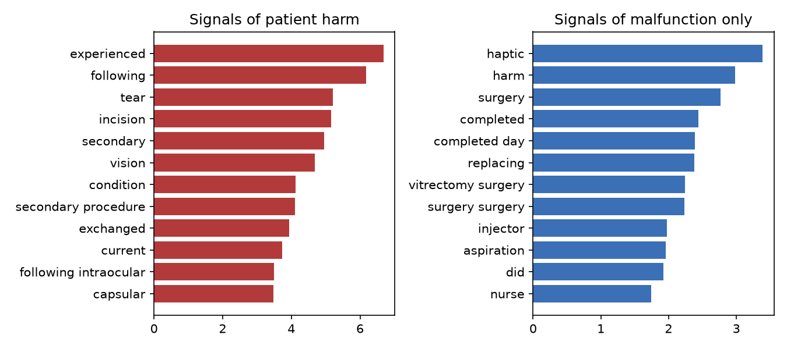
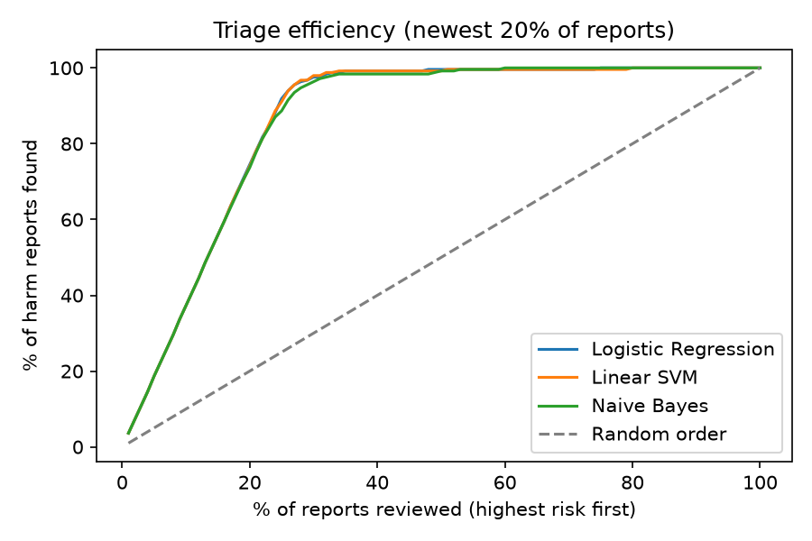
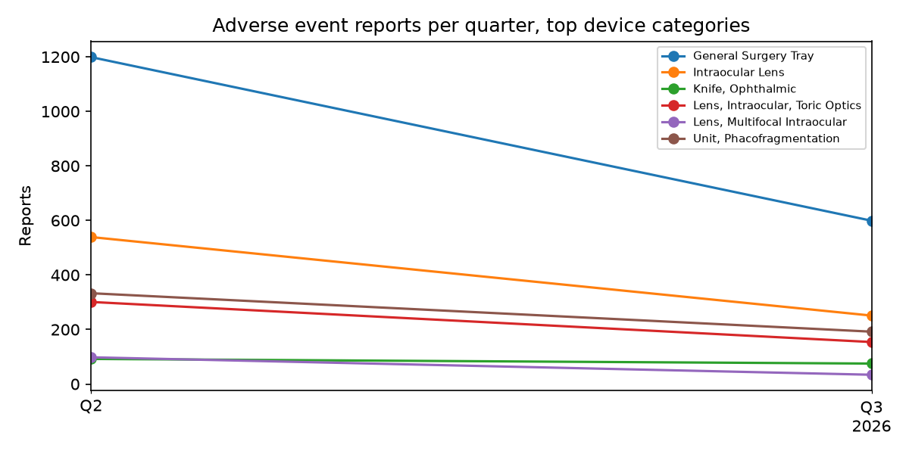

# SafeSignal: Medical Device Safety Triage (NLP)

Pulls Alcon device adverse event reports from the FDA MAUDE database through the openFDA API, discovers complaint themes with topic modeling, and trains a text classifier that **triages incoming reports by likelihood of patient harm** so safety teams can review the most serious ones first.

**Stack:** Python · openFDA REST API · pandas · scikit-learn (TF-IDF, Logistic Regression, Linear SVM, Naive Bayes, NMF) · Matplotlib · Streamlit

**🚀 Live dashboard:** [safesignal-bushra.streamlit.app](https://safesignal-bushra.streamlit.app)

---

## Business Problem

Medical device makers receive a steady stream of complaint and adverse event reports, mostly free text. Reports involving **patient injury** need faster clinical review than reports about a device malfunction alone. Reading every report in arrival order is slow. This project:

1. Surfaces **what patients and surgeons are reporting** (themes, trends, top product problems)
2. **Ranks new reports by harm risk** from the narrative text alone

## Data

[openFDA Device Adverse Event API](https://open.fda.gov/apis/device/event/) (FDA MAUDE). `src/download_data.py` queries reports where the manufacturer is Alcon and keeps the event type, device category, product problems, and the "Description of Event or Problem" narrative.

## Approach

**Data preparation**
- Text cleaning: lowercasing, removing FDA redaction tokens like `(b)(6)`, punctuation, and numbers
- **Exact duplicate narratives removed.** Templated reports would otherwise appear in both train and test and inflate scores.
- Target: `harm = 1` for Injury/Death, `0` for Malfunction

**Part A, Post-market surveillance analytics**
- Quarterly report volume for top device categories
- Most frequent FDA product-problem codes
- **NMF topic modeling** on TF-IDF features to discover 8 complaint themes, with the harm rate of each theme

**Part B, Harm triage classifier**
- TF-IDF unigrams + bigrams, sublinear term frequency
- Compared Logistic Regression, calibrated Linear SVM, and Complement Naive Bayes
- **Time-based split.** Trained on older reports, tested on the newest 20%.
- Metrics: recall on harm reports, PR-AUC, and **triage efficiency** (share of harm reports found when reviewing the riskiest 30% first)
- Explainability: model coefficients show which words signal patient harm vs. malfunction

## Results

> Full output: [`results/results.md`](results/results.md)

<!-- Paste key numbers from results/results.md after running train.py -->

| Metric | Value |
|---|---|
| Reports analyzed | _from results.md_ |
| Best model | _from results.md_ |
| Harm recall | _from results.md_ |
| PR-AUC | _from results.md_ |
| Harm reports found in top-30% review | _from results.md_ |





## Run It

```bash
pip install -r requirements.txt
python src/download_data.py --api-key YOUR_KEY   # free key: open.fda.gov/apis/authentication
python src/train.py
streamlit run app.py
```

## Limitations

- MAUDE reports are unverified and can be incomplete or duplicated. Report counts are not incidence rates.
- Event type is assigned by the reporter, so labels contain some noise.
- This is a prioritization aid for human reviewers, not an automated regulatory decision.

## Next Steps

- Fine-tune a clinical transformer model (e.g., BioClinicalBERT) and compare to TF-IDF
- Multi-label classification of product-problem codes
- Statistical signal detection for unusual spikes in a theme over time
